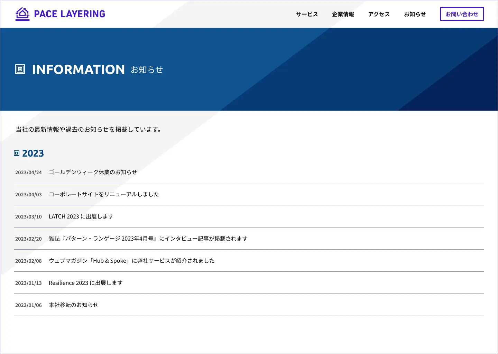
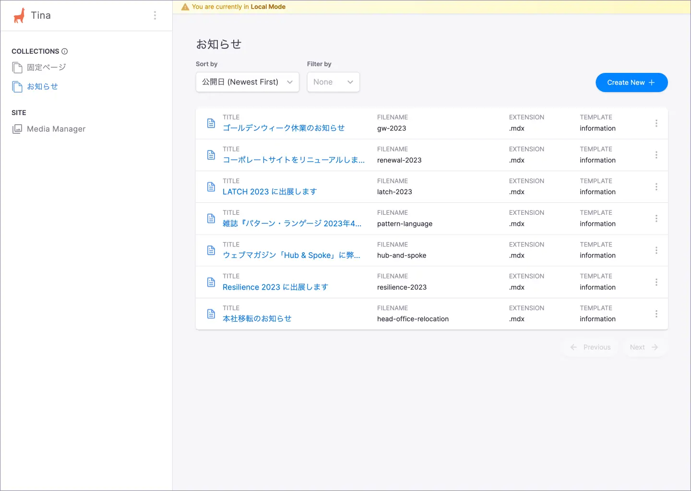
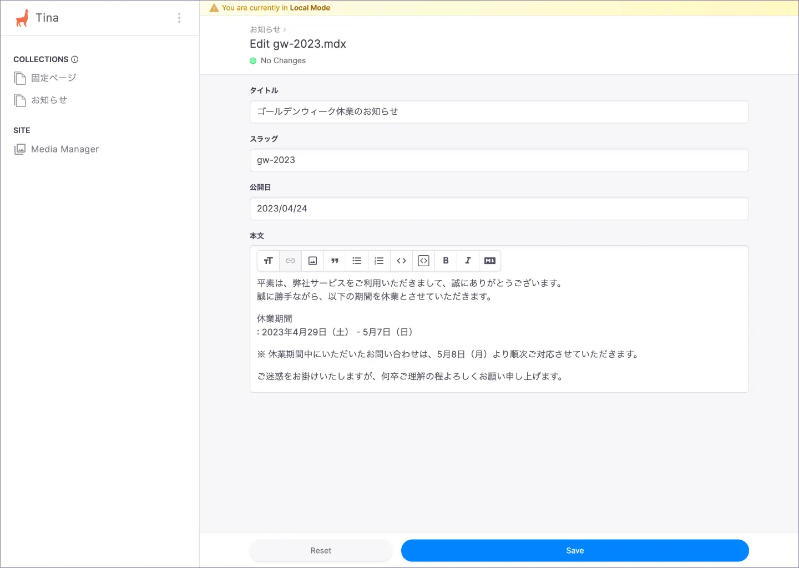

# お知らせ

お知らせの編集方法について説明します。

## CMS 管理画面

TinaCMS の管理画面にアクセスし、サイドバーから「**お知らせ**」に遷移します。

### お知らせ 記事一覧

既存の記事を編集する場合には該当の記事を選択し、新規記事を作成するには「**Create New**」を選択します。

### お知らせ 記事詳細

## 編集可能な項目

編集可能な項目は以下のとおりです。

| 項目 | 内容 |
| --- | --- |
| タイトル | 記事のタイトルです。 |
| スラッグ | ページのスラッグ（URL）を、小文字の英数字と `-`（ハイフン）で指定します。 |
| 公開日 | 公開日を指定します。 |
| 本文 | 記事本文を入力します。 |

## 変更内容の保存

変更後「**Save**」ボタンを選択すると、該当の MDX ファイルが更新されます。
