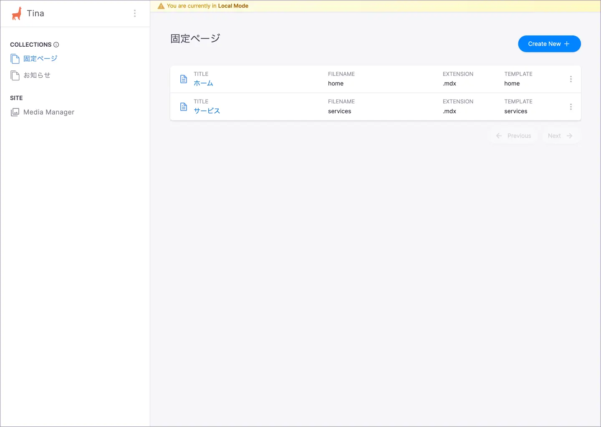
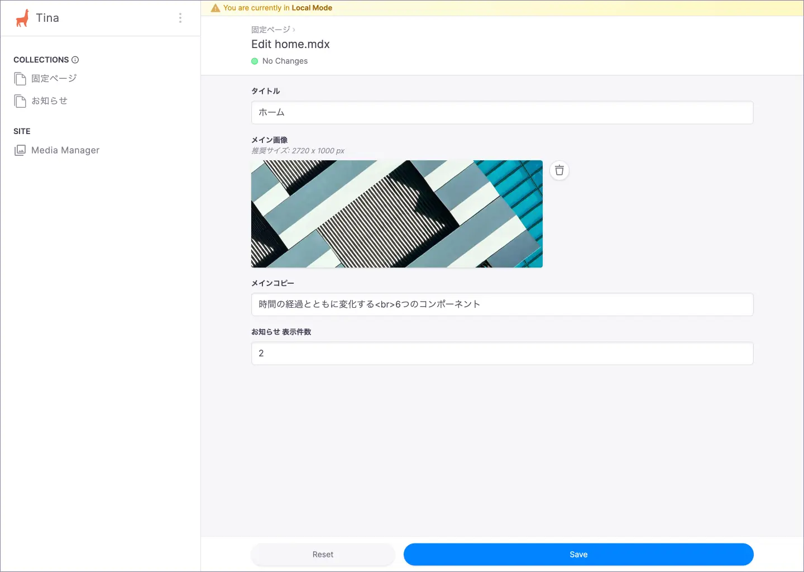

# ホーム

ホームページの編集方法について説明します。

## CMS 管理画面

TinaCMS の管理画面にアクセスし、サイドバーから「**固定ページ** > **ホーム**」に遷移します。

### 固定ページ

### ホーム

## 編集可能な項目

編集可能な項目は以下のとおりです。

| 項目 | 内容 |
| --- | --- |
| メイン画像 | メイン画像です。推奨サイズは 2720 x 1000 px です。 |
| メインコピー | メイン画像の上に重なるコピーです。改行する場合には ` ` タグを使用します。 |
| お知らせ 表示件数 | ホームに表示するお知らせの最大件数です。 |

## 変更内容の保存

変更後「**Save**」ボタンを選択すると、該当の MDX ファイルが更新されます。
