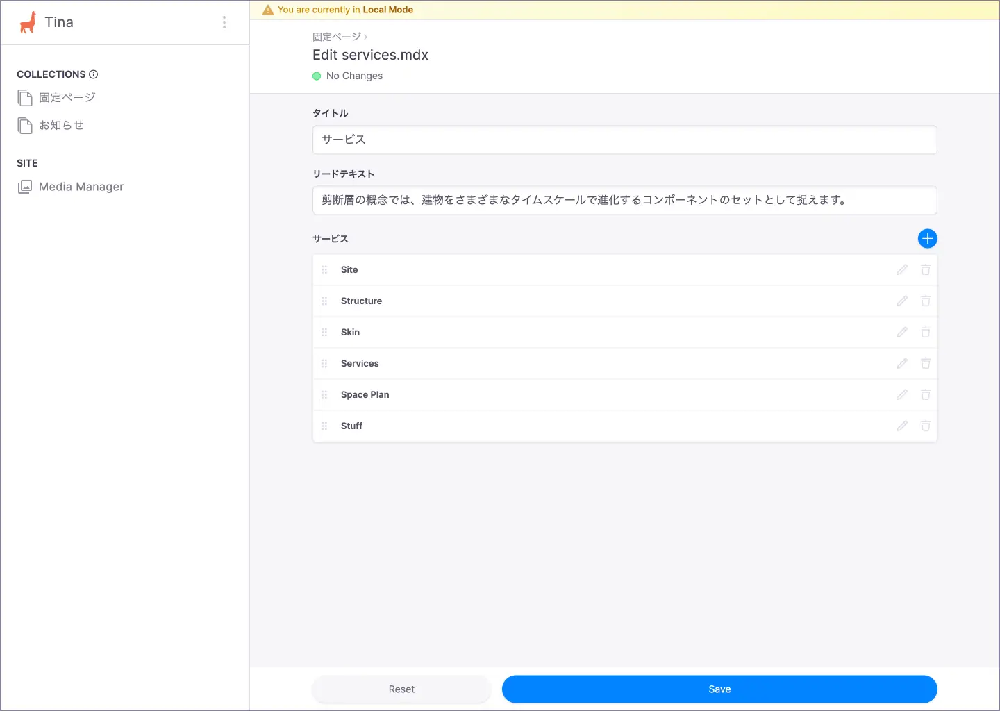

# サービス

サービスページの編集方法について説明します。

## CMS 管理画面

TinaCMS の管理画面にアクセスし、サイドバーから「**固定ページ** > **サービス**」に遷移します。

### 固定ページ

### サービス

## 編集可能な項目

編集可能な項目は以下のとおりです。

| 項目 | 内容 |
| --- | --- |
| リードテキスト | 見出し下のリードテキストです。 |
| サービス | サービスごとに見出しと説明文を変更できます。 |

## 変更内容の保存

変更後「**Save**」ボタンを選択すると、該当の MDX ファイルが更新されます。
